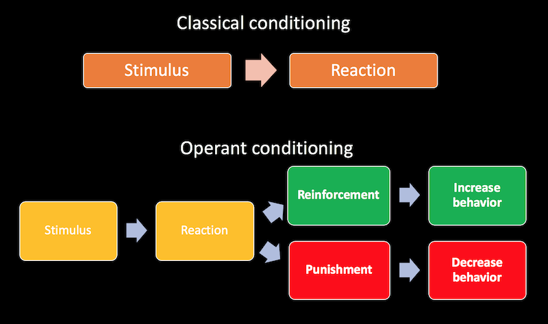

#  Introduction to psychology

---

#  Course info

* Introduction to psychology, Nursing ED, 2021/22
* Taught by Krzysztof Basiński PhD, Agata Zdun-Ryżewska PhD
* Department of Psychology

---

#  Contact

* E-mail: k.basinski@gumed.edu.pl
* Office: ul. Tuwima 15, room 312 (third floor)
* Phone: 58 349 15 55, 58 349 15 69

---

#  Class hours and forms of credit

* 30h lectures (with me and dr Agata Zdun-Ryżewska)
* 14h online workshops (Interpersonal Communication)
* 6h in-person workshops
* Self-learning task
* Written exam

---

#  Self-learning task

* Last class of Interpersonal Communication (somewhere in January)
* Choose any topic (from the lectures or practical classes)
* Prepare a presentation and a small workshop
* Time: approx. 20min.
* Presentations can use slides but *DO NOT READ THEM, PRESENT THEM*
* E-mail the presentations to me before class (ppt & pdf!)

---

#  Introduction to psychology

---

#  What is psychology?

* From greek: psyche – soul; logos – science (literally “word”)
* Psychology – a scientific discipline that studies psychological and biological processes and behaviour in humans and other animal (Encyclopaedia Brittanicca)
* Psychology is the study of behaviour and mind, embracing all aspects of conscious and unconscious experience as well as thought (Wikipedia)

---

#  What is NOT psychology?

* Philosophy (love of wisdom, study of general and fundamental problems concerning matters such as existence, knowledge, values, reason, mind, language)
* Sociology (study of social behavior or society, including its origins, development, organization, networks and institutions)

---

#  What is NOT psychology?

* Physiology (study of the normal function in living systems, a sub-discipline of biology, focuses on how organisms, organ systems, organs, cells and biomolecules carry out the chemical or physical functions that exist in a living system)
* Pseudo-scientific, non-scientific or layman psychology

---

| **SCIENTIFIC** | **NON-SCIENTIFIC** |
|:---|---|
| Verified by empirical research  | Theories based on common knowledge
| Results published in peer-reviewed journals | Publications in popular magazines, internet |
| Replicable research | No research is conducted |

---

#  Methods in psychology
* Observational studies
* Case studies
* Introspection
* Interviews
* Questionnaire studies
* **Experiments**

---

#  A brief history of psychology

* Until the end of 19th century psychology was in fact part of philosophy
* Socrates, Plato, Aristotle, Thomas Aquinas, Hume, Locke, Descartes, Kant… 

---

#  A brief history

* 1879 – first psychological laboratory, Wilhelm Wundt, University Leipzig, Germany 
* Since then psychology as a separate scientific discipline

---

#  Historical movements in psychology

* Psychoanalysis
* Behaviorism

---

#  Psychoanalysis

---

#  Psychoanalysis

---

#  Psychoanalysis

* Created by Sigmund Freud (1856-1939), a neurologist working in Vienna
* Modified versions of psychoanalysis are still widely used in psychotherapy
* Its scientific status is often disputed

---

#  Psychoanalysis

<https://www.youtube.com/watch?v=nJm7AhdGbDk>

---

#  Psychoanalysis

1. A person's development is determined by often forgotten events in early childhood rather than by inherited traits alone
2. Human attitude, mannerism, experience, and thought is largely influenced by irrational drives that are rooted in the unconscious
3. It is necessary to bypass psychological resistance in the form of defense mechanisms when bringing drives into awareness

---

#  Psychoanalysis

4. Conflicts between the conscious and the unconscious, or with repressed material can materialize in the form of mental or emotional disturbances, for example: neurosis, neurotic traits, anxiety, depression etc.
5. Liberating the elements of the unconscious is achieved through bringing this material into the conscious mind (via e.g. skilled guidance, i.e. therapeutic intervention).

---

### Personality in psychoanalysis

---

### Psychoanalytic therapy - tools

* Free associations method
* Analysis of dreams
* Analysis of defense mechanisms
* Re-living things that happened in the past
* Hypnosis

---

#  Behaviorism

---

#  Behaviorism

* Created by John Watson (early 20th century), expanded by B.F.Skinner (1930s-1950s)
* Psychology should only be concerned with the study of *objective, observable behaviour*
* Phenomena such as thoughts, feelings, values, etc. are *not measurable*, and should be of no concern to scientists

---

#  Behaviorism

* This view is now somewhat obsolete, though learning theory is a part of modern cognitive psychology
* A key component of behaviorism is the *process of conditioning*

---

#  Mechanisms of learning

* **Classical conditioning** (Ivan Pavlov)
* **Operant conditioning** (Thorndike, Skinner, Konorski)
* **Modelling / social learning theory** (Bandura)

---

#  Classical conditioning

---

#  Classical conditioning works on people

[The Little Albert Experiment](https://www.youtube.com/watch?v=FMnhyGozLyE)

---

#  Operant conditioning

---

#  Reinforcement:

  - Increases the chance that behavior will occur again in future
  - Positive reinforcement occurs when a behavior (response) is rewarding or the behavior is followed by another stimulus that is rewarding, increasing the frequency of that behavior. 
  - Negative reinforcement occurs when the rate of a behavior increases because an aversive event or stimulus is removed or prevented from happening.

---

#  Punishment:
* Decreases the chance of repeating the behavior in future
* Positive punishment - presenting aversive stimuli
* Negative punishment – removing the reinforcing stimulus 

---

#  Operant vs. classical conditioning

<https://www.youtube.com/watch?v=H6LEcM0E0io>

---

#  Behavioral theory – applications

* Applied behavior analysis – a radical behaviorist method of treatment, useful in autism, behavioral disorders, substance abuse
* Various animal learning models (i.e. used in physiological research)

---

#  Behavioral theory – applications

* Cognitive-behavioral therapy – most widely used evidence-based intervention for treating mental disorders (i.e. depression, mood disorders, PTSD, eating disorders, OCD) as well as some supplementary treatment for other conditions (i.e. chronic low back pain, fibromyalgia)

