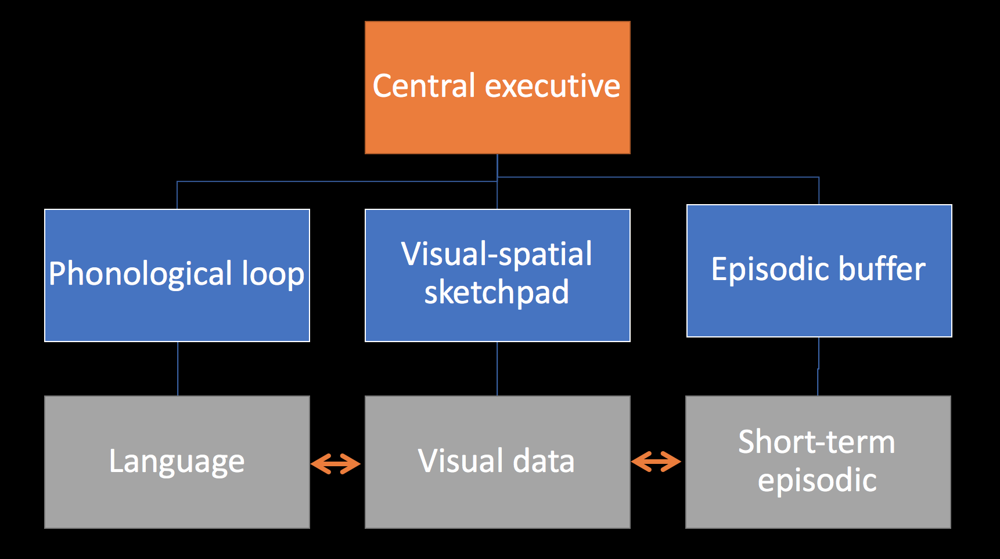
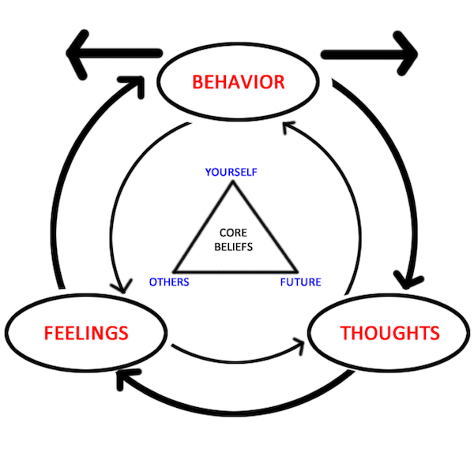

# Behaviorism

## Behaviorism
- Created by John Watson (early 20th century) in opposition to “mentalist” psychology (mainly introspection)
- Radical behaviorism: psychology should only be concerned with the study of *objective, observable behaviour*
- Phenomena such as thoughts, feelings, values, etc. are *not measurable*, and should be of no concern to scientists

## Behaviorism
- This view is now somewhat obsolete, though learning theory is a part of modern cognitive psychology
- A key component of behaviorism is the *process of conditioning*

## Mechanisms of learning
- **Classical conditioning** (Ivan Pavlov)
- **Operant conditioning** (Thorndike, Skinner, Konorski)
- **Modelling / social learning theory** (Bandura)

## Classical conditioning

## Operant conditioning

## Reinforcement:
  - Increases the chance that behavior will occur again in future
  - Positive reinforcement occurs when a behavior (response) is rewarding or the behavior is followed by another stimulus that is rewarding, increasing the frequency of that behavior. 
  - Negative reinforcement occurs when the rate of a behavior increases because an aversive event or stimulus is removed or prevented from happening.

## Punishment:
- Decreases the chance of repeating the behavior in future
- Positive punishment - presenting aversive stimuli
- Negative punishment – removing the reinforcing stimulus 

## Behavioral theory – applications
- Applied behavior analysis – a radical behaviorist method of treatment, useful in autism, behavioral disorders, substance abuse
- Cognitive-behavioral therapy – most widely used evidence-based intervention for treating mental disorders (i.e. depression, mood disorders, PTSD, eating disorders, OCD) as well as some supplementary treatment for other conditions (i.e. chronic low back pain, fibromyalgia)
- Various animal learning models (i.e. used in physiological research)

# Cognitive psychology

## Cognitive psychology
- Behaviorism, language and cognitive revolution
- 1959 – Noam Chomsky, critique of Verbal Behavior by Skinner
- Behaviorist theory struggles with explaining language
- A new paradigm in psychology – cognitive psychology

## Noam Chomsky

## Noam Chomsky
- Father of modern linguistics
- Universal grammar theory
- Chomsky’s Hierarchy -  a theoretical model of formal languages (theoretical basis for computer programming languages)
- Attributed greatly to cognitive revolution
- Most frequently cited living scientist (now 87 years old)

## Cognitive dissonance
- A theory by Leon Festinger
- A dissonance is a feeling of discomfort when two an individual has, at the same time, two cognitions (thoughts, attitudes) that are in conflict with each other
- The feeling of dissonance enables the individual to seek actions that reduce the dissonance – a source of motivation
- A person will actively avoid information that may enlarge the dissonance

## Memory

- Types of memory:
    - Sensory, short-term and long-term memory (multi-store model of memory)
    - Procedural and declarative memory
    - Semantic and episodic memory
    - Working memory

## Memory as a process

## Multi-store model (Atkinson, Shiffrin)

## Problems with multi-store model
- Too simplistic – different kinds of memory (semantic and procedural long-term, visual and auditory sensory etc)
- We are capable of remembering things without rehearsal
- Data from patient with brain damage (Zlonoga and Gerber, 1986)
    - Difficulties regarding short-term memory. 
    - Recognition of sounds such as spoken numbers, letters, words and easily identifiable noises (such as doorbells and cats meowing) were all impacted 
    - Visual short-term memory was unaffected, suggesting a dichotomy between visual and audial memory

## Working memory model (Baddeley, Hitch)

## Properties of human memory
- Incredibly capacious – 2.5 petabytes? (2,500,000 GB)
- Long-lasting – some memories last a lifetime
- Prone to error (“what did you do on September 11th?”)

## Neuroscience and memory
- Storage for long-term memory – hippocampus & amygdala (emotional memory)
- Working memory:
    - Phonological loop – (left) temporal lobe
    - Visual-spatial sketchpad – (left) occipital and parietal lobes
    - Episodic buffer – frontal lobe

## Cognitive psychology and behavioral theory in practice: Cognitive-Behavioral Therapy

- A form of psychotherapy – tool for treatment of depression
- Used in many disorders, i.e. depression, anxiety disorders, obsessive-compulsive disorder, PTSD etc.
- Aim is to solve specific, actual problems of the individual
- Therapy by changing behavior and thinking
- A combination of behavioral and cognitive therapy techniques

## CBT: basic assumptions

## CBT: basic assumptions

- Behavior, cognitive and emotional processes are connected
- Disturbances in those three areas are sources of disorders
- Human behavior is not always based on rational thought
- Behavior may sometimes be formed by conditioning of responses that are not adaptational