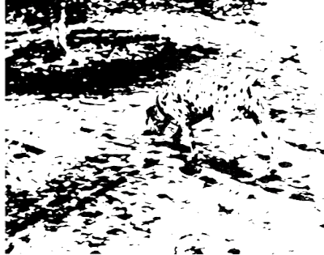
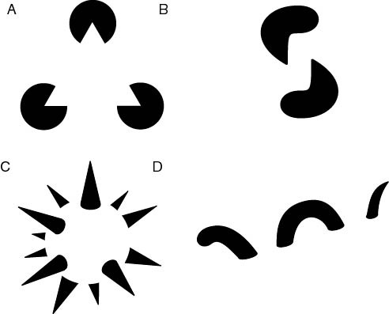
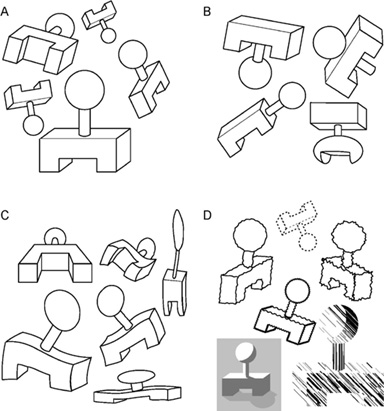

### Cognition

### What is cognition

> "The mental action or process of acquiring knowledge and understanding through thought, experience, and the senses"
*(Oxford English Dictionary)*

### What is cognition

- Attention
- The formation of knowledge 
- Memory 
- Judgment and evaluation 
- Reasoning and "computation" 
- Problem solving and decision making 
- Comprehension and production of language

### Cognitive psychology

- Behaviorism, language and cognitive revolution
- 1959 – Noam Chomsky, critique of Verbal Behavior by Skinner
- Behaviorist theory struggles with explaining language
- A new paradigm in psychology – cognitive psychology

### Noam Chomsky

### Noam Chomsky

- Father of modern linguistics
- Universal grammar theory
- Chomsky’s Hierarchy -  a theoretical model of formal languages (theoretical basis for computer programming languages)
- Attributed greatly to cognitive revolution
- Most frequently cited living scientist

### The computer metaphor

- The mind  is a "computer" that is physically implemented by neural activity in the brain
- Input via perception, output via behavior

### Perception 

### Perception

### Perception

- The tracks are converging – sensation 
- The tracks are parallel – perception

### Gestalt psychology

- A movement in German psychology, late 19th century
- It is not possible to describe the human mind by analyzing its structure, one needs to look at the global whole
- *“The whole is something other than the sum of its parts”* (Kurt Koffka)

### Gestalt – emergence

### Gestalt – emergence
- We see a dog (a Dalmatian?)
- We do not recognize its parts independently (nose, ears, head, paws)
- We see the dog in its entirety, at once
- “The whole is something other than the sum of its parts”

### Gestalt – reification

### Gestalt – reification

- Our perception can generate more information on the object than it is given in reality
- In picture A we see a triangle, though there is no triangle drawn
- In pictures B and D, the eye recognizes disparate shapes as "belonging" to a single shape 
- In C a complete three-dimensional shape is seen, where actually no such thing is drawn

### Gestalt - multistability

### Gestalt - multistability

### Gestalt - multistability

- Multistability is a tendency of ambiguous perceptual experiences to pop back and forth unstably between two or more alternative interpretations
- Gestalt psychologists described the effect but did not give an explanation
- The Necker Cube is used today to test computer-based models of perception

### Gestalt - invariance

### Gestalt - invariance
- Invariance is the property of perception whereby simple geometrical objects are recognized independent of rotation, translation, and scale; as well as several other variations such as elastic deformations, different lighting, and different component features
- These laws of perception were since explored by cognitive psychologists, and some are puzzling to this day

### Perception today
- Perception is generative
- Same stimulus may be interpreted in different ways depending on:
    - Context
    - Who is looking
    - Memory is used in perception

### Memory

- Types of memory:
    - Sensory, short-term and long-term memory (multi-store model of memory)
    - Procedural and declarative memory
    - Semantic and episodic memory

### Memory as a process

### Multi-store model (Atkinson, Shiffrin)

### Properties of human memory

- Incredibly capacious – 2.5 petabytes? (2,500,000 GB)
- Long-lasting – some memories last a lifetime (some don't last a minute)
- Prone to error (“what did you do on September 11th?”)

### Intelligence

### What is intelligence?

> Capacity for logic, understanding, self-awareness, learning, emotional knowledge, reasoning, planning, creativity, critical thinking, and problem solving

### What is intelligence?

> The ability to perceive or infer information, and to retain it as knowledge to be applied towards adaptive behaviors within an environment.

### Intelligence is problematic

- What if...
    - someone is good at maths but bad at English?
    - someone is good at English but bad at maths?
    - someone is bad at English and maths but is a world-class pianist?
    - Einstein was born in a hunter-gatherer tribe?

### Intelligence is multi-dimensional

- People are good at different cognitive skills
- These tend to correlate with each other
- Overall intelligence (as measured by IQ) takes **a lot of those skills** into account

### Intelligence Quotient - IQ

### IQ Measures

- Wechsler Intelligence Scale (WAIS)
- Raven's Progressive Matrices

### WAIS example tasks

- Similarities: Describe how two words or concepts are similar. 
- Vocabulary: Name objects in pictures or define words presented to them. 
- Information: General knowledge questions.

### WAIS example tasks

- Comprehension: Questions about social situations or common concepts.
- Digit Span: Listen to sequences of numbers orally and to repeat them as heard, in reverse order, and in ascending order. 
- Arithmetic: Orally administered arithmetic word problems. Timed. 

### Raven's Matrices

### Nature vs. nurture

- IQ depends on nature (genetic factors)
- IQ depends on nurture (education, experience, age)

### IQ correlates

- School performance (0.50 - 0.80)
- Job performance (0.20 - 0.60)
- Income (0.23)
- Crime (-0.20)
- Mortality/morbidity (-, very weak)

### IQ - Facts and myths

- Can you teach intelligence?
- Yes, you can! To some degree...
- In fact, educated societies tend to get smarter over time

### IQ - Facts and myths

- You are either born smart or stupid
- Yes and no
- There are significant genetic and environmental components of IQ

### IQ - Facts and myths

- White/black/yellow/red people smarter than white/black/yellow/red people
- No! 
- The question is in fact ill-posed
- IQ is defined through a mean of population. Thus, different cultures have by definition the same average IQ = 100.

### IQ - Facts and myths

- Are rich people are smarter than poor people?
- Hard to say
- Correlation is 0.20 (very, very weak)
- Richer people might be better educated

### Cognitive-Behavioral Therapy (CBT)

### CBT

- A form of psychotherapy – tool for treatment of depression
- Used in many disorders, i.e. depression, anxiety disorders, obsessive-compulsive disorder, PTSD etc.
- Aim is to solve specific, actual problems of the individual
- Therapy by changing behavior and thinking
- A combination of behavioral and cognitive therapy techniques

### CBT: basic assumptions

### CBT: basic assumptions

- Behavior, cognitive and emotional processes are connected
- Disturbances in those three areas are sources of disorders
- Human behavior is not always based on rational thought
- Behavior may sometimes be formed by conditioning of responses that are not adaptational