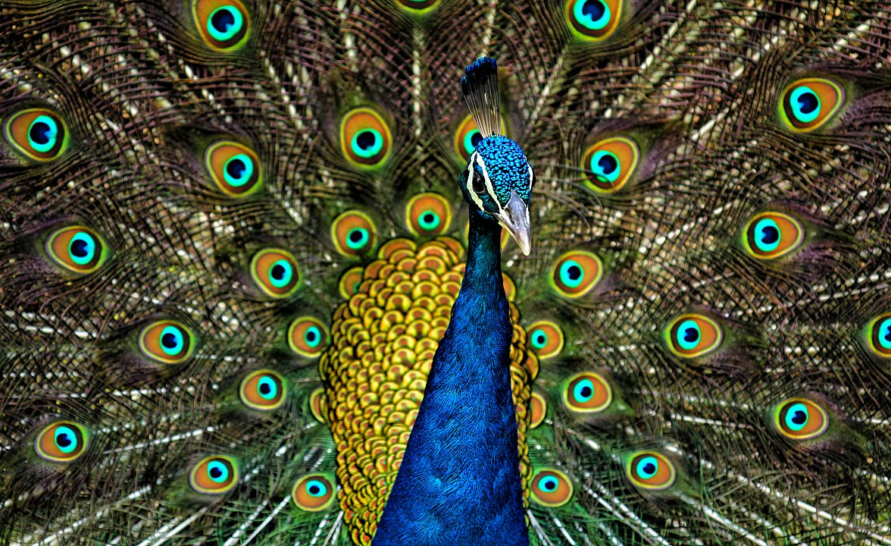

### Modern psychology

* Explores **behavior and mental processes** 
* These include: perception, thought, attention, emotion, intelligence, subjective experiences, motivation, personality and more
* Studies conscious **and** unconscious phenomena
* Analysis from **individual as well as social** perspectives

---

### Modern psychology

- Focuses on **cognition** (*cognitive science*)
- Uses **neuroscience** to inform the study of the mind
- Frequently explains psychological phenomena in terms of their **evolutionary fitness**
- Is also a practical discipline, focused on assessment and treatment of mental health problems, counselling, education etc.

---

# Cognition

---

### What is cognition

> "The mental action or process of acquiring knowledge and understanding through thought, experience, and the senses"
*(Oxford English Dictionary)*

---

### What is cognition

- Attention
- The formation of knowledge 
- Memory 
- Judgment and evaluation 
- Reasoning and "computation" 
- Problem solving and decision making 
- Comprehension and production of language

---

### Cognitive psychology

- Behaviorism, language and cognitive revolution
- 1959 – Noam Chomsky, critique of Verbal Behavior by Skinner
- Behaviorist theory struggles with explaining language
- A new paradigm in psychology – cognitive psychology

---

### Noam Chomsky

---

### The computer metaphor

- The mind  is a "computer" that is physically implemented by neural activity in the brain
- Input via perception, output via behavior

---

# Evolutionary psychology

---

### What is evolution? (after Wikipedia)

- Evolution is change in the heritable characteristics of biological populations over successive generations
- These characteristics are the expressions of genes that are passed on from parent to offspring during reproduction 
- Different characteristics tend to exist within any given population as a result of mutation, genetic recombination and other sources of genetic variation

---

### What is evolution? (after Wikipedia)

- Evolution occurs when evolutionary processes such as natural selection (including sexual selection) and genetic drift act on this variation, resulting in certain characteristics becoming more common or rare within a population
- It is this process of evolution that has given rise to biodiversity at every level of biological organisation, including the levels of species, individual organisms and molecules

---

### Evolution & psychology

- Modern psychology is grounded in evolutionary thinking
- Evolutionary principles apply to all animals (including people)
- Psychological processes have been shaped by evolution the same way as anatomy and physiology
- *"Evolutionary psychology is the radical notion that human behavior is part of the natural world"*

---

### Mechanisms of evolution

- Natural selection
- Sexual selection
- Kin selection / inclusive fitness
- Reciprocity
- Genetic drift 

---

### Natural selection

- Traits that increase the chance of **reproductive success** (RS) are selected for and kept during evolution
- These traits have high evolutionary **fitness** (they fit into the environment)

---

### Sexual selection

---

---

### Sexual selection

- Why the tail? Does it increase the chance of survival?
- Does it increase the chance of RS?
- Why?
- If a peacock has everything other peacocks have PLUS a huge, colorful tail, it's a sign of great genes

---

### Kin selection / inclusive fitness

- Increase RS of kin, even at own expense
- Altruism is proportional to % of shared genes:
  - Identical twins - 100%
  - Siblings - 50%
  - Cousins - 12.5% etc.

---

### Reciprocity

- Organism A decreases chance of RS, increasing the RS of organism B
- A does this because it expects B to do the same
- If B cheats, A stops helping
- More complex scenarios play out on the basis of [game theory](https://en.wikipedia.org/wiki/Tit_for_tat)

---

### Others

- Genetic drift
- Spandrels

---

### The most wide spread myth about evolution

Animals do stuff _for the good of the species_

---

### Environment of evolutionary adaptedness

- Enviroment that formed evolutionary adaptations
- Homo sapiens spent 99% of their evolutionary time in hunter-gatherer groups of about 150 closely related people
- *"Our modern skulls house a Stone Age mind"* - Cosmides & Tooby, 1997

---

### Examples

- Social bonding and behaviors
- Mating behavior
- Eating habits
- Stress, coping and _lifestyle disease_
