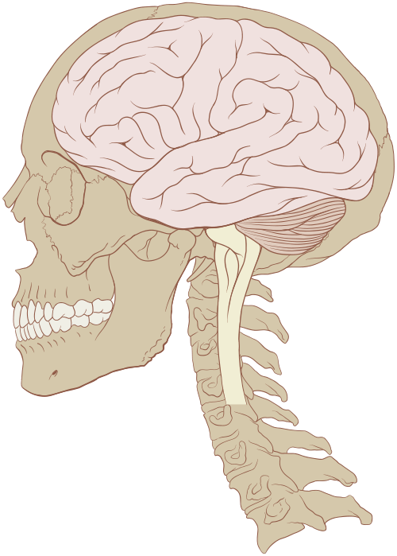
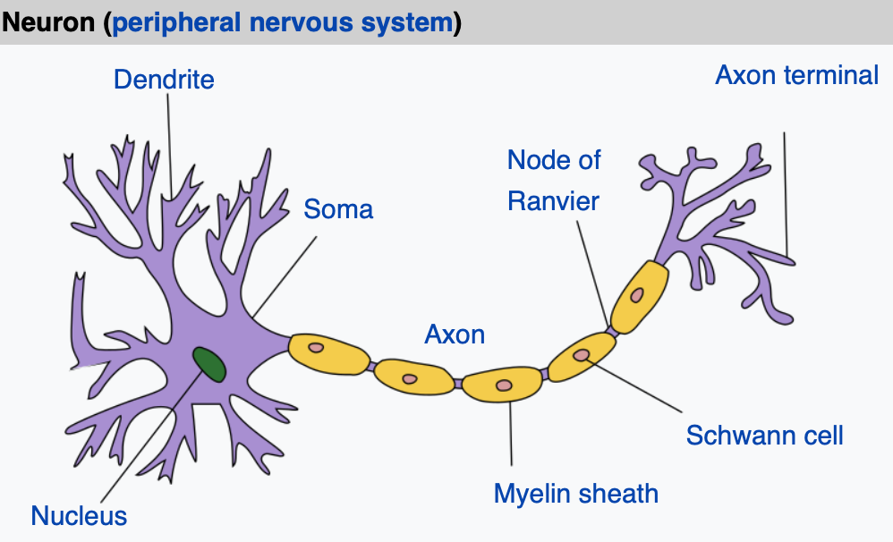
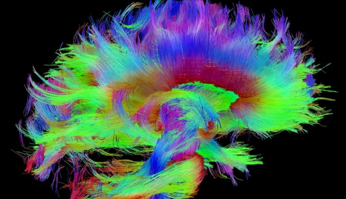
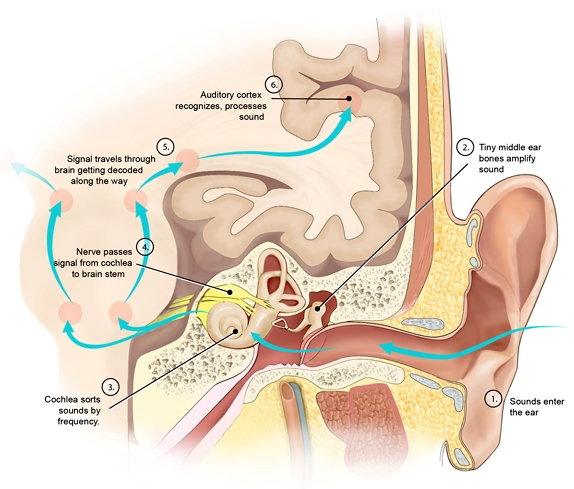
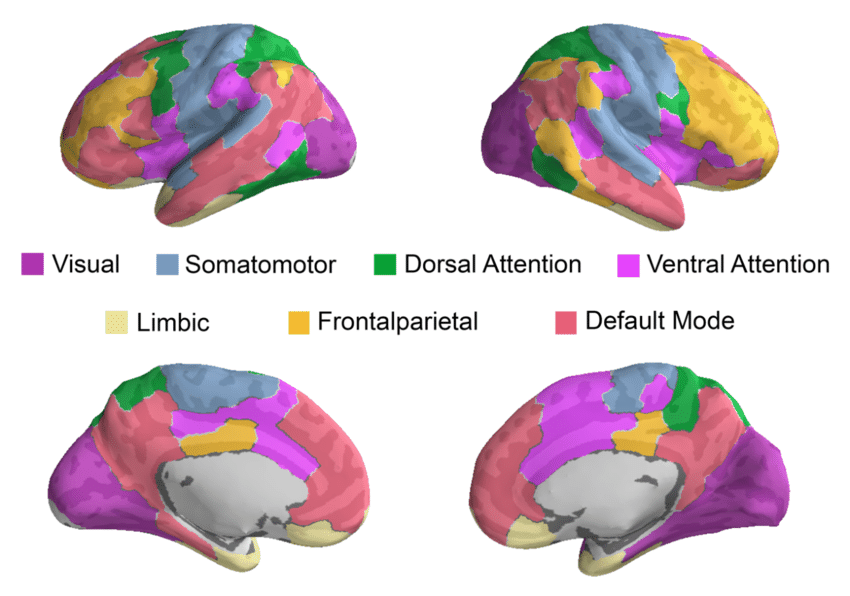
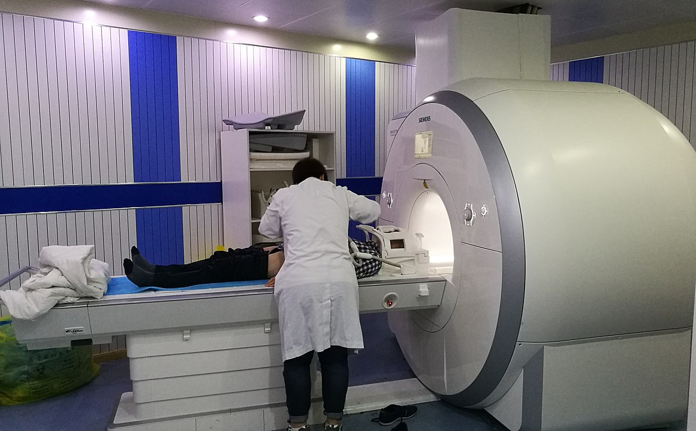
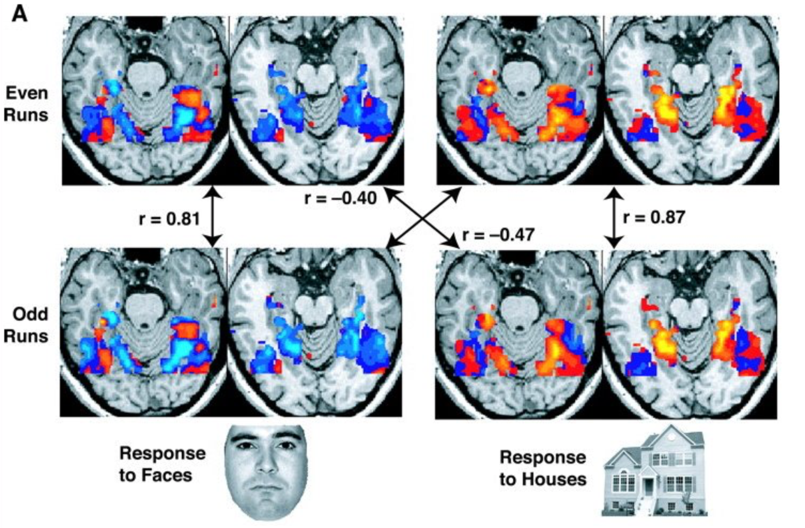
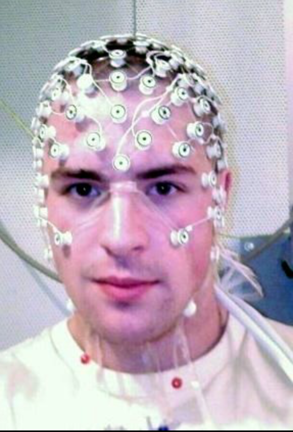
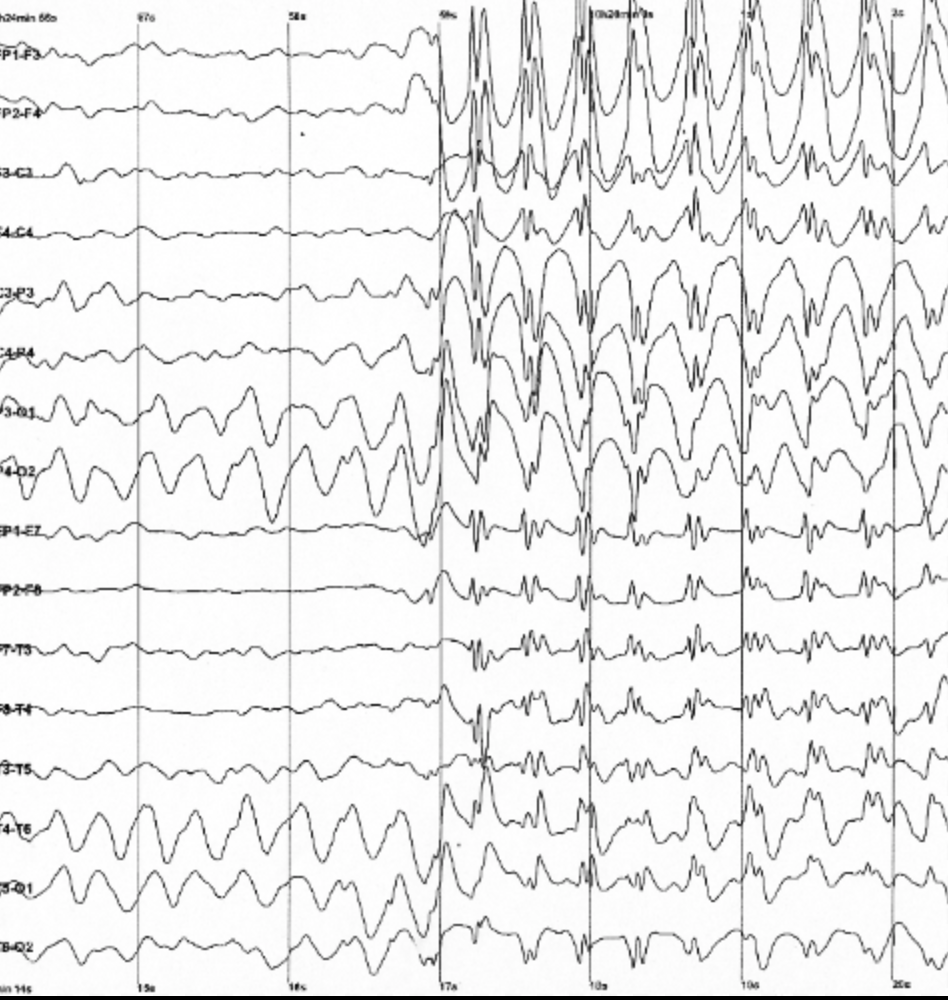

### The brain and how to study it

---

---

### Brain facts

* By far the most complex organ
* Cerebral cortex has about 15 billion neurons
* Cerebellum has 55-70 billion
* Each neuron connects to up to several thousands other neurons

---

### Neurons

---

### Neurons synapse with eachother

---

### Whole brain is connected

---

### Example - auditory pathway

---

### Neurons form functional networks

--- 

### Networks and function

* Many networks perform a given function
* Many functions are perfomed by a given network

---

### How do we know all this?

---

### Functional Magnetic Resonanse Imaging (fMRI)

---

### fMRI

---

### fMRI

* Blood-oxygen-level dependent signal (BOLD)
* You can see the function _in vivo_ (kinda)
* Good spatial resolution
* Poor temporal resolution

---

### Electroencephalography (EEG)

---

### EEG results

---

### Other methods

* MEG (magnetoencephalography)
* PET (positron emission tomography)
* NIRS (near-infrared spectroscopy)
* Pupillometry
* Electrodermal response