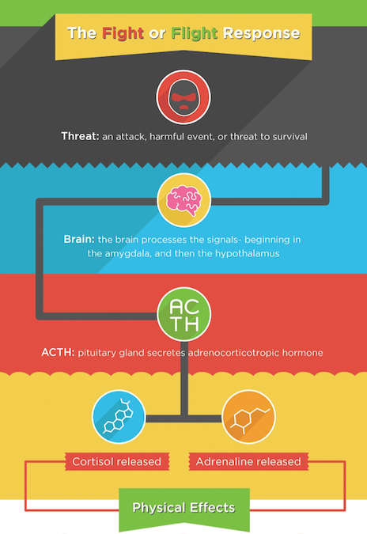
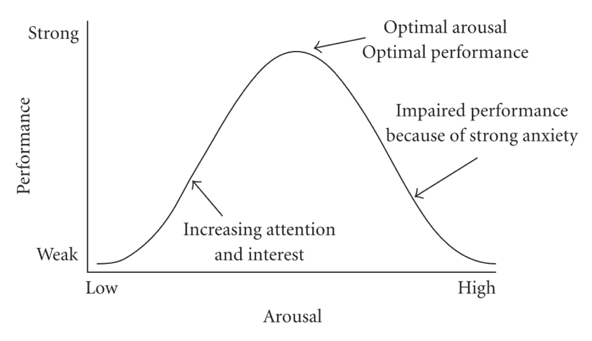
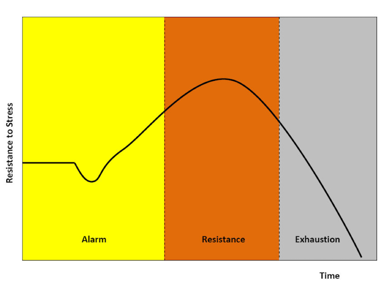

# Stress

## What is stress
- Stress (biology) – a physiological response to a *stressor*. The response is associated with the activation of the sympathetic nervous system. A normal state (*homeostasis*)  is achieved via parasympathetic activation.
- Stress (psychological) is when individual feels that he/she cannot cope with the situation.
- Stressor – a stimulus that causes stress
- Acute stress – strong, short-term
- Chronic stress – longer, weaker

## Fight or flight response– Walter Cannon (1915)
- A physiological theory (concerns animals)
- When in danger, animal reacts with sudden discharge of the sympathetic nervous system
- Two possible reactions:
    - Fight
    - Flight (also camouflage, stillness)

***

## Sympathetic activation - physiological effects
- Increased heart rate
- Bladder relaxation
- Tunnel vision
- Shaking
- Dialated pupils
- Flushed face
- Dried mouth
- Slowed digestion
- Hearing loss

## Theory of stress - Hans Selye (1974)
- Distress – negative, destructive stress
- Eustress – positive, motivational stress
- Reaction to stress based on Yerkes-Dodson Law

## Yerkes-Dodson Law for stress

## General Adaptation Syndrome – Hans Selye

## Transactional stress theory – Lazarus & Folkman (1970)
- What is stressful to some, may not be stressful to others
- Stressful is only what we perceive as stressful
- Stress is a consequence of
    - *Primary appraisal* (evaluation of the significance of a stressor or threatening event) 
    - *Secondary appraisal* (evaluation of the controllability of the stressor and a person’s coping resources)

## Categories of primary appraisal
- Hurt/loss – the loss has occurred
- Threat – the loss may happen in the future
- Challenge – there can be gains and losses

## Secondary appraisal
- Evaluation of how well can we handle the situation
- If we can handle it – eustress
- If not – distress

## Two possible strategies of coping with stress:
- Task-oriented
- Emotional

# Social psychology

## Social Psychology - themes
INTRAPERSONAL

- Attitudes
- Persuasion
- Social cognition
- The Self

## Social Psychology - themes
INTERPERSONAL

- Social influence
- Dynamics of group relationships
- Reletionships with others
- Interpersonal attractiveness

## Conformity – S.Asch experiment

## Authority – S.Milgram

## Stanford prison experiment (P. Zimbardo)
- Financed by US Office of Naval Research in order to explain cases of violence towards inmates in army prisons
- Aim: to test the hypothesis that personality characteristics are the main cause of aggression in prison
- Participants: a group of 24 men chosen as the most stable and “normal” psychologically from a broader range of volunteers
- Inmates were stripped of their identity, guards were given attributes of power

## Stanford prison experiment (P. Zimbardo)
- The experiment has been stopped after 6 days (two weeks planned)
- Physical and psychological violence occurred:
    - Beating with a fire extinguisher
    - Taking away clothes and mattresses
    - Use of “isolation chamber”
    - Favoring “better” inmates 
    - 30% of the guards exhibited sadistic behavior

## Stanford prison experiment ((P. Zimbardo)
- The results are consistent with the hypothesis of situational attribution of behavior (opposite of dispositional attribution)
- In line with the Milgram experiment
- Shows the strength of institutionalization as a factor influencing behavior

