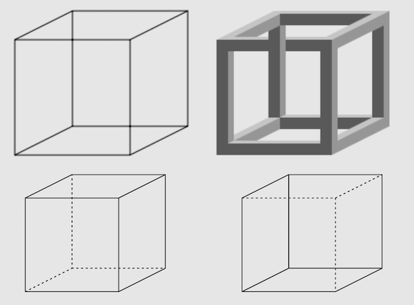

### Perception 

---

### Perception

* The tracks are converging – sensation 
* The tracks are parallel – perception

---

### Perception

---

### Gestalt psychology

* A movement in German psychology, late 19th century
* It is not possible to describe the human mind by analyzing its structure, one needs to look at the global whole
* *“The whole is something other than the sum of its parts”* (Kurt Koffka)

---

### Gestalt – emergence

---

### Gestalt – emergence
* We see a dog (a Dalmatian?)
* We do not recognize its parts independently (nose, ears, head, paws)
* We see the dog in its entirety, at once
* “The whole is something other than the sum of its parts”

---

### Gestalt – reification

---

### Gestalt – reification

* Our perception can generate more information on the object than it is given in reality
* In picture A we see a triangle, though there is no triangle drawn
* In pictures B and D, the eye recognizes disparate shapes as "belonging" to a single shape 
* In C a complete three-dimensional shape is seen, where actually no such thing is drawn

---

### Gestalt - multistability

---

### Gestalt - multistability

* Multistability is a tendency of ambiguous perceptual experiences to pop back and forth unstably between two or more alternative interpretations
* Gestalt psychologists described the effect but did not give an explanation
* The Necker Cube is used today to test computer-based models of perception

---

### Gestalt - invariance

---

### Gestalt - invariance
* Invariance is the property of perception whereby simple geometrical objects are recognized independent of rotation, translation, and scale; as well as several other variations such as elastic deformations, different lighting, and different component features
* These laws of perception were since explored by cognitive psychologists, and some are puzzling to this day

---

### Perception is generative

* We generate the world around us
* Same stimulus may be interpreted in differently depending on:
    * Context
    * Who is looking
    * What actions are taken
    * Motivational state
    * Previous experiences

---

### Predictive processing

---

Lisa Feldman Barrett - How Emotions Are Made? The Secret Life of the Brain

---

---

---

### Predictive processing

* Brain is in the business of **predicting future states**
* Your senses **predict future percepts**