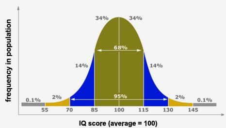

### Memory

---

### Types of memory:

- Sensory, short-term and long-term memory (multi-store model of memory)
- Procedural and declarative memory
- Semantic and episodic memory

---

### Memory as a process

---

### Multi-store model (Atkinson, Shiffrin)

---

### Properties of human memory

- Incredibly capacious – 2.5 petabytes? (2,500,000 GB)
- Long-lasting – some memories last a lifetime (some don't last a minute)
- Prone to error (“what did you do on September 11th?”)

---

### Intelligence

---

### What is intelligence?

> Capacity for logic, understanding, self-awareness, learning, emotional knowledge, reasoning, planning, creativity, critical thinking, and problem solving

---

### What is intelligence?

> The ability to perceive or infer information, and to retain it as knowledge to be applied towards adaptive behaviors within an environment.

---

### Intelligence is problematic

- What if...
    - someone is good at maths but bad at English?
    - someone is good at English but bad at maths?
    - someone is bad at English and maths but is a world-class pianist?
    - Einstein was born in a hunter-gatherer tribe?

---

### Intelligence is multi-dimensional

- People are good at different cognitive skills
- These tend to correlate with each other
- Overall intelligence (as measured by IQ) takes **a lot of those skills** into account

---

### Intelligence Quotient - IQ

---

### IQ Measures

- Wechsler Intelligence Scale (WAIS)
- Raven's Progressive Matrices

---

### WAIS example tasks

- Similarities: Describe how two words or concepts are similar. 
- Vocabulary: Name objects in pictures or define words presented to them. 
- Information: General knowledge questions.

---

### WAIS example tasks

- Comprehension: Questions about social situations or common concepts.
- Digit Span: Listen to sequences of numbers orally and to repeat them as heard, in reverse order, and in ascending order. 
- Arithmetic: Orally administered arithmetic word problems. Timed. 

---

### Raven's Matrices

---

### Nature vs. nurture

- IQ depends on nature (genetic factors)
- IQ depends on nurture (education, experience, age)

---

### IQ correlates

- School performance (0.50 - 0.80)
- Job performance (0.20 - 0.60)
- Income (0.23)
- Crime (-0.20)
- Mortality/morbidity (-, very weak)

---

### IQ - Facts and myths

- Can you teach intelligence?
- Yes, you can! To some degree...
- In fact, educated societies tend to get smarter over time

---

### IQ - Facts and myths

- You are either born smart or stupid
- Yes and no
- There are significant genetic and environmental components of IQ

---

### IQ - Facts and myths

- White/black/yellow/red people smarter than white/black/yellow/red people
- No! 
- The question is in fact ill-posed
- IQ is defined through a mean of population. Thus, different cultures have by definition the same average IQ = 100.

---

### IQ - Facts and myths

- Are rich people are smarter than poor people?
- Hard to say
- Correlation is 0.20 (very, very weak)
- Richer people might be better educated