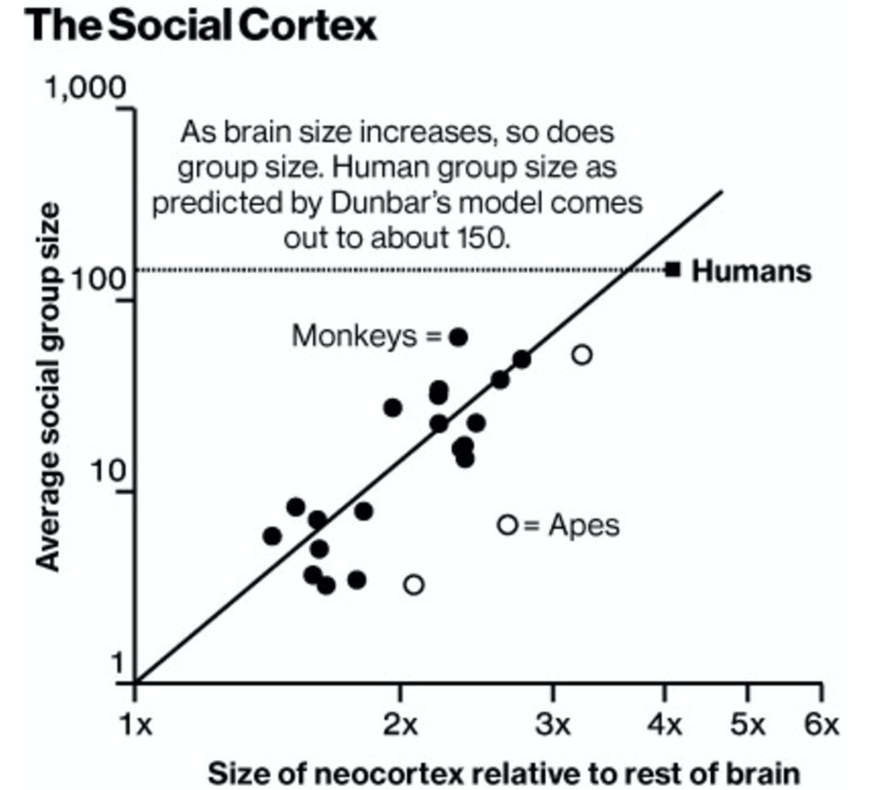

### Social psychology

---

### People = social animals

---

### Social Psychology - themes

- Attitudes
- Persuasion
- Social cognition
- Social influence
- Dynamics of group relationships
- Relationships with others
- Attractiveness

---

### Conformity – S.Asch experiment

<https://www.youtube.com/watch?v=TYIh4MkcfJA>

---

### Conformity

- Group influence
- Asch experiment - 57% incorrect vs. 1% without group influence

---

### Two types of conformity

- Informational conformity:
  - Actually change your beliefs
- Normative conformity:
  - You know that's not true but you go along nonetheless

---
### Controlling normative conformity

- If nobody hears your answer, you're immune from criticism
- Conformity drops by 2/3

---

### Group unanimity

- Unanimity = everybody agrees with themselves
- Size of group matters until circa 5 people
- Unanimity is more important than size
- Even one deviant significantly reduces conformity

---

### Authority – S.Milgram

<https://www.youtube.com/watch?v=y6GxIuljT3w>

---

### Milgram Experiment

- Backdrop - WW2, Nurnberg trials
- Are there limits to responsibility when listening to orders (ie. in the military)?
- Ambiguous situation ("it causes no damage" vs. high voltage shocks)
- Soft persuasion (_the experiment requires you to continue_)

---

### Milgram Experiment

- The results replicated many times
- _White coat effect_ in many different situations (uniform, smart dress, etc)

---
### Milgram Experiment

- Think about this - does it apply to some situations in healthcare?
- Ethical issues?

