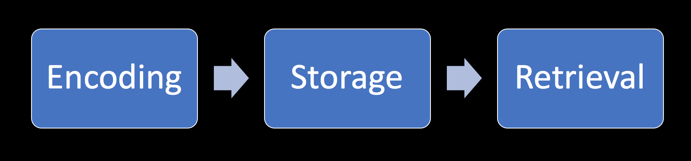
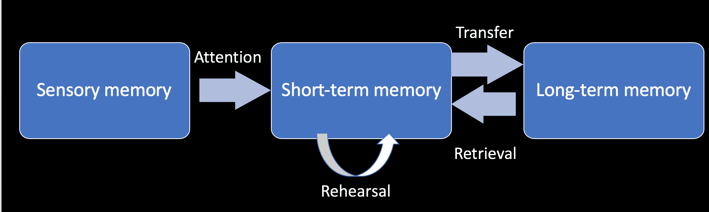
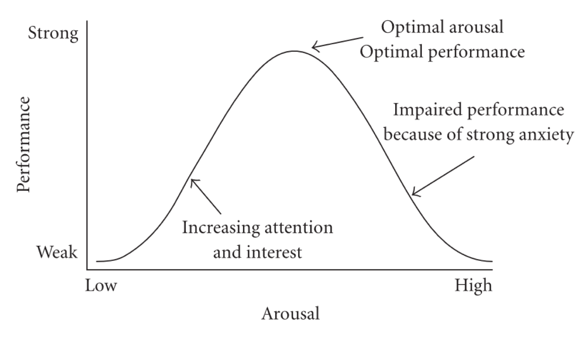

```{r setup, include=FALSE}
knitr::opts_chunk$set(echo = TRUE)
```

# Course info
Introduction to psychology
Nursing ED, 2016/17

Krzysztof Basiński, Agata Zdun-Ryżewska

Department of Quality of Life Research

## Contact
E-mail: k.basinski@gumed.edu.pl
Office: ul. Tuwima 15, room 312 (third floor)
Phone: 58 349 15 55, 58 349 15 69

# Introduction to psychology

## What is psychology?
- From greek: psyche – soul; logos – science (literally “word”)
- Psychology – a scientific discipline that studies psychological and biological processes and behaviour in humans and other animal (Encyclopaedia Brittanicca)
- Psychology is the study of behaviour and mind, embracing all aspects of conscious and unconscious experience as well as thought (Wikipedia)

## A brief history of psychology
- Scholars have been reflecting on psychological problems since ancient times
- Until the end of 19th century psychology was in fact part of philosophy
- Socrates, Plato, Aristotle, Thomas Aquinas, Hume, Locke, Descartes, Kant… 
- 1879 – first psychological laboratory, Wilhelm Wundt, University Leipzig, Germany 
- Since then psychology as a separate scientific discipline


# Psychoanalysis

## Psychoanalysis
- Created by Sigmund Freud (1856-1939), a neurologist working in Vienna
- Modified versions of psychoanalysis are still widely used in psychotherapy
- Its scientific status is often disputed

## Psychoanalysis – basic assumptions
1. A person's development is determined by often forgotten events in early childhood rather than by inherited traits alone
2. Human attitude, mannerism, experience, and thought is largely influenced by irrational drives that are rooted in the unconscious
3. It is necessary to bypass psychological resistance in the form of defense mechanisms when bringing drives into awareness
4. Conflicts between the conscious and the unconscious, or with repressed material can materialize in the form of mental or emotional disturbances, for example: neurosis, neurotic traits, anxiety, depression etc.
5. Liberating the elements of the unconscious is achieved through bringing this material into the conscious mind (via e.g. skilled guidance, i.e. therapeutic intervention).

## Personality in psychoanalysis


## Psychoanalytic therapy - tools
- Free associations method
- Analysis of dreams
- Analysis of defense mechanisms
- Re-living things that happened in the past
- Hypnosis

# Behaviorism

- Created by John Watson (early 20th century) in opposition to “mentalist” psychology (mainly introspection)
- Radical behaviorism: psychology should only be concerned with the study of *objective, observable behaviour*
- Phenomena such as thoughts, feelings, values, etc. are *not measurable*, and should be of no concern to scientists
- This view is now somewhat obsolete, though learning theory is a part of modern cognitive psychology
- A key component of behaviorism is the *process of conditioning*


## Mechanisms of learning
- **Classical conditioning** (Ivan Pavlov)
- **Operant conditioning** (Thorndike, Skinner, Konorski)
- **Modelling / social learning theory** (Bandura)

## Classical conditioning


## Operant conditioning


## Reinforcement:
  - Increases the chance that behavior will occur again in future
  - Positive reinforcement occurs when a behavior (response) is rewarding or the behavior is followed by another stimulus that is rewarding, increasing the frequency of that behavior. 
  - Negative reinforcement occurs when the rate of a behavior increases because an aversive event or stimulus is removed or prevented from happening.

## Punishment:
- Decreases the chance of repeating the behavior in future
- Positive punishment - presenting aversive stimuli
- Negative punishment – removing the reinforcing stimulus 

## Behavioral theory – applications
- Applied behavior analysis – a radical behaviorist method of treatment, useful in autism, behavioral disorders, substance abuse
- Cognitive-behavioral therapy – most widely used evidence-based intervention for treating mental disorders (i.e. depression, mood disorders, PTSD, eating disorders, OCD) as well as some supplementary treatment for other conditions (i.e. chronic low back pain, fibromyalgia)
- Various animal learning models (i.e. used in physiological research)


# Cognitive psychology

## Cognitive dissonance
- A theory by Leon Festinger
- A dissonance is a feeling of discomfort when an individual has, at the same time, two cognitions (thoughts, attitudes) that are in conflict with each other
- The feeling of dissonance enables the individual to seek actions that reduce the dissonance – a source of motivation
- A person will actively avoid information that may enlarge the dissonance

## Memory
Types of memory
- Sensory, short-term and long-term memory (multi-store model of memory)
- Procedural and declarative memory
- Semantic and episodic memory
- Working memory

## Memory as a process


## Multi-store model (Atkinson, Shiffrin)



## Cognitive psychology and behavioral theory in practice – Cognitive-Behavioral Therapy
- A form of psychotherapy – tool for treatment of depression
- Used in many disorders, i.e. depression, anxiety disorders, obsessive-compulsive disorder, PTSD etc.
- Aim is to solve specific, actual problems of the individual
- Therapy by changing behavior and thinking
- A combination of behavioral and cognitive therapy techniques


# Stress

## What is stress
- Stress (biology) – a physiological response to a *stressor*. The response is associated with the activation of the sympathetic nervous system. A normal state (*homeostasis*)  is achieved via parasympathetic activation.
- Stress (psychological) is when individual feels that he/she cannot cope with the situation.
- Stressor – a stimulus that causes stress
- Acute stress – strong, short-term
- Chronic stress – longer, weaker

## Fight or flight response– Walter Cannon (1915)
- A physiological theory (concerns animals)
- When in danger, animal reacts with sudden discharge of the sympathetic nervous system
- Two possible reactions:
    - Fight
    - Flight (also camouflage, stillness)


## Sympathetic activation - physiological effects
- Increased heart rate
- Bladder relaxation
- Tunnel vision
- Shaking
- Dialated pupils
- Flushed face
- Dried mouth
- Slowed digestion
- Hearing loss

## Theory of stress - Hans Selye (1974)
- *Distress* – negative, destructive stress
- *Eustress* – positive, motivational stress
- Reaction to stress based on Yerkes-Dodson Law

## Yerkes-Dodson Law for stress


## General Adaptation Syndrome – Hans Selye


## Transactional stress theory – Lazarus & Folkman (1970)
- What is stressful to some, may not be stressful to others
- Stressful is only what we perceive as stressful
- Stress is a consequence of
    - *Primary appraisal* (evaluation of the significance of a stressor or threatening event) 
    - *Secondary appraisal* (evaluation of the controllability of the stressor and a person’s coping resources)

## Categories of primary appraisal
- Hurt/loss – the loss has occurred
- Threat – the loss may happen in the future
- Challenge – there can be gains and losses

## Secondary appraisal
- Evaluation of how well can we handle the situation
- If we can handle it – eustress
- If not – distress

## Two possible strategies of coping with stress:
- Task-oriented
- Emotional

# Social psychology

## Conformity – S.Asch experiment
<https://www.youtube.com/watch?v=NyDDyT1lDhA>

## Authority – S.Milgram
<https://www.youtube.com/watch?v=Xxq4QtK3j0Y>

## Stanford prison experiment (P. Zimbardo)
- Financed by US Office of Naval Research in order to explain cases of violence towards inmates in army prisons
- Aim: to test the hypothesis that personality characteristics are the main cause of aggression in prison
- Participants: a group of 24 men chosen as the most stable and “normal” psychologically from a broader range of volunteers
- Inmates were stripped of their identity, guards were given attributes of power

## Stanford prison experiment (P. Zimbardo)
- The experiment has been stopped after 6 days (two weeks planned)
- Physical and psychological violence occurred:
    - Beating with a fire extinguisher
    - Taking away clothes and mattresses
    - Use of “isolation chamber”
    - Favoring “better” inmates 
    - 30% of the guards exhibited sadistic behavior

## Stanford prison experiment (P. Zimbardo)
- The results are consistent with the hypothesis of situational attribution of behavior (opposite of dispositional attribution)
- In line with the Milgram experiment
- Shows the strength of institutionalization as a factor influencing behavior


# Developmental psychology

## Attachment theory (J. Bowlby)
- A psychological model that attempts to describe the dynamics of long-term and short-term interpersonal relationships between humans
- How human beings respond within relationships when hurt, separated from loved ones, or perceiving a threat?
- An infant needs to develop a relationship with at least one primary caregiver for the child's successful social and emotional development

## Types of attachment
- Secure
- Anxious-avoidant
- Anxious-ambivalent
- Disorganized

## Secure attachment
- Child will explore freely while the caregiver is present, typically engages with strangers, is often visibly upset when the caregiver departs, and is generally happy to see the caregiver return
- Parents who consistently (or almost always) respond to their child's needs will create securely attached children 
- Such children are certain that their parents will be responsive to their needs and communications.

## Anxious-ambivalent
- A child with an anxious-ambivalent pattern will typically explore little and is often wary of strangers, even when the parent is present
- When the mother departs, the child is often highly distressed
- The child is generally ambivalent when she returns 
- The anxious-ambivalent strategy is a response to unpredictably responsive caregiving

## Anxious-avoidant
- An infant with an anxious-avoidant pattern of attachment will avoid or ignore the caregiver — showing little emotion when the caregiver departs or returns
- The infant will not explore very much regardless of who is there. 
- Ainsworth and Bell theorised that the apparently unruffled behaviour of the avoidant infants was in fact a mask for distress, a hypothesis later evidenced through studies of the heart-rate of avoidant infants

## Piaget's theory of cognitive development
Jean Piaget (1896-1980)


- Comprehensive theory about the nature and development of human intelligence
- Development - progressive reorganization of mental processes resulting from biological maturation and environmental experience
- Four stages of development
    - Sensorimotor
    - Preoperational
    - Concrete operational
    - Formal operational

## Sensorimotor stage
- From birth to acquisition of language (0-24 months)
- Infants gain knowledge of the world from the physical actions they perform within it
- Object permanence is a child's understanding that objects continue to exist even though he or she cannot see or hear them
- By the end of the sensorimotor period, children develop a permanent sense of self and object

## Preoperational stage
- 2-7 years
- Children do not yet understand concrete logic and cannot mentally manipulate information
- I.e. if a < b and b < c than is a < c ?
- Egocentric thinking (difficulty seeing other’s point of view)

## Concrete operational stage
- 7-11 years
- Logical thinking
- Elimination of egocentrism
- At this stage child learns rules such as conservation of volume, mass etc.
- Inductive resoning, still problems with deductive reasoning

## Formal operational stage
- 11-15 until adulthood
- Logical use of symbols related to abstract concepts
- Abstract thought
- Metacognition – thinking about thinking
- Methodical problem-solving (not only trial and error)

## A few concerns
- Theory concerned with cognitive development only
- Stages of development do not have strict age boundaries
- Not all people reach formal operational stage – association with intelligence
